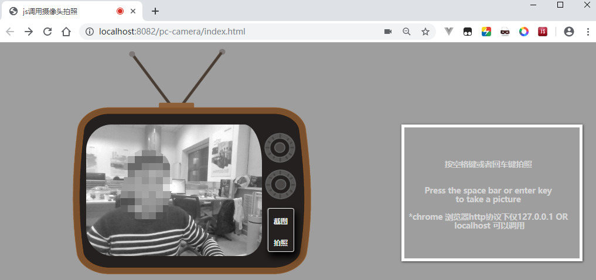

# pc-camera
调用pc摄像头显示,并且可以拍照

### 使用方法
- 直接打开index.html页面即可

### 兼容浏览器
- 谷歌(http协议下仅127.0.0.1 OR localhost 可以调用)
- 火狐
- edge

### 不兼容IE

### 页面

****

Call pc camera display and can take pictures

### Instructions
-Just open the index.html page

### compatible browser
- Google (only 127.0.0.1 or localhost can be called under http protocol)
-Firefox
-edge

### Not compatible with IE

### Page
